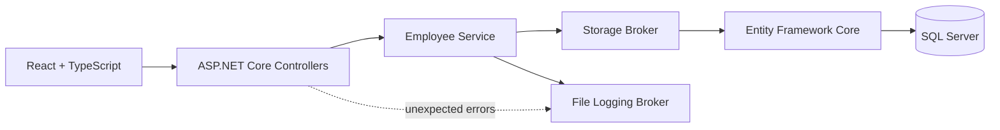

# Employee Management System

A full-stack employee management application built with **ASP.NET Core**, **Entity Framework Core**, **SQL Server**, **React**, and **TypeScript**.

The project focuses on clean backend separation, API design, database-backed querying, pagination, sorting, soft deletion, structured error logging, and frontend/backend integration.

---

## Overview

The application provides a simple employee-management workflow while demonstrating backend engineering concepts beyond basic CRUD.

The backend separates responsibilities across:

```text
Controller → Service → Broker → Database
```

This keeps HTTP handling, business logic, persistence, and infrastructure concerns isolated from one another.

---

## Features

### Employee Management

- create employees
- list employees
- search employees by name
- server-side pagination
- server-side sorting
- soft-delete employees
- activate/deactivate employees
- retrieve supported departments

### API

- RESTful ASP.NET Core controllers
- DTO-based request and response models
- configurable pagination
- deterministic sorting
- structured HTTP responses
- Scalar API documentation
- OpenAPI specification

### Persistence

- SQL Server
- Entity Framework Core
- EF Core migrations
- `AsNoTracking()` for read-only queries
- soft-delete filtering
- asynchronous database operations

### Reliability

- cancellation-token propagation
- dedicated file-logging broker
- centralized unexpected-error handling
- bounded page sizes
- separation between storage and business logic

### Frontend

- React
- TypeScript
- Vite
- Tailwind CSS
- typed API service
- employee listing
- search
- pagination
- sorting
- employee creation
- soft deletion
- active/inactive status management

---

## Architecture



### Controller Layer

Controllers handle HTTP concerns and delegate business behavior to services.

For example:

```text
EmployeesController
    ↓
IEmployeeService
```

### Service Layer

`EmployeeService` handles application logic including:

- search
- sorting
- pagination
- soft deletion
- active-status changes
- DTO mapping
- error logging

### Broker Layer

Infrastructure is abstracted behind brokers.

```text
IStorageBroker
    ↓
StorageBroker
    ↓
AppDbContext
    ↓
SQL Server
```

This prevents the service layer from depending directly on EF Core's database context.

A separate `IFileLoggingBroker` handles error persistence.

---

## Tech Stack

| Area | Technologies |
| --- | --- |
| Backend | C#, ASP.NET Core, .NET 10 |
| ORM | Entity Framework Core |
| Database | SQL Server |
| Mapping | AutoMapper |
| API Documentation | OpenAPI, Scalar |
| Frontend | React 19, TypeScript |
| Build Tool | Vite |
| Styling | Tailwind CSS |

---

## API

### Employees

| Method | Endpoint | Purpose |
| --- | --- | --- |
| `GET` | `/api/Employees` | List, search, sort and paginate employees |
| `POST` | `/api/Employees` | Create an employee |
| `DELETE` | `/api/Employees/{id}` | Soft-delete an employee |
| `PATCH` | `/api/Employees/{id}/toggle-active` | Toggle active/inactive status |

The list endpoint supports query parameters such as:

```text
searchTerm
pageNumber
pageSize
sortBy
sortDirection
```

Page size is limited by the API to prevent unbounded queries.

### Departments

| Method | Endpoint | Purpose |
| --- | --- | --- |
| `GET` | `/api/Departments` | Retrieve supported departments |

---

## Project Structure

```text
EmployeeManagement/
├── EmployeeManagement/
│   ├── Brokers/
│   │   ├── FileLoggingBroker/
│   │   └── StorageBroker/
│   ├── Controllers/
│   ├── Data/
│   ├── DTOs/
│   ├── Migrations/
│   ├── Models/
│   ├── Profiles/
│   ├── Services/
│   ├── Program.cs
│   └── appsettings.json
│
├── employee-management-client/
│   └── src/
│       ├── services/
│       └── ...
│
└── README.md
```

---

## Getting Started

### Prerequisites

Install:

- .NET 10 SDK
- SQL Server
- Node.js
- npm

---

## Backend Setup

Clone the repository and navigate to it.

Update the database connection string if your SQL Server instance differs from the default development configuration:

```json
{
  "ConnectionStrings": {
    "DefaultConnection": "Server=localhost\\SQLEXPRESS;Database=EmployeeManagementDb;Trusted_Connection=True;TrustServerCertificate=True"
  }
}
```

Restore dependencies:

```bash
dotnet restore
```

Apply the database migrations:

```bash
dotnet ef database update --project EmployeeManagement/EmployeeManagement.csproj --startup-project EmployeeManagement/EmployeeManagement.csproj
```

Run the backend:

```bash
dotnet run --project EmployeeManagement/EmployeeManagement.csproj
```

The HTTP development profile runs at:

```text
http://localhost:5114
```

The HTTPS profile also exposes:

```text
https://localhost:7053
```

---

## API Documentation

While the backend is running, Scalar API documentation is available at:

```text
http://localhost:5114/scalar/v1
```

The OpenAPI document is also exposed by the application.

---

## Frontend Setup

Navigate to the frontend:

```bash
cd employee-management-client
```

Install dependencies:

```bash
npm install
```

Optionally configure the backend URL:

```env
VITE_API_BASE_URL=http://localhost:5114
```

If no value is provided, the frontend currently falls back to:

```text
http://localhost:5114
```

Start the frontend:

```bash
npm run dev
```

---

## Engineering Highlights

### Server-side pagination

Pagination happens in the database query using `Skip()` and `Take()` rather than loading the entire employee table into memory.

### Search

Employee search is composed directly into the `IQueryable`, allowing SQL Server to perform the filtering.

### Sorting

Employees can be sorted by:

- full name
- email
- hire date
- salary
- department
- active status

A deterministic ID-based secondary sort is applied to keep result ordering stable.

### Soft deletion

Deleting an employee does not physically remove the database row.

Instead:

```text
IsDeleted = true
```

Normal employee queries exclude deleted records.

### Read-query optimization

Read-only employee queries use:

```csharp
AsNoTracking()
```

to avoid unnecessary Entity Framework change tracking.

### Error logging

Application and service failures are recorded through a dedicated file-logging broker instead of mixing infrastructure logging directly into business logic.

---

## Build

Backend:

```bash
dotnet build EmployeeManagement.slnx
```

Frontend:

```bash
cd employee-management-client
npm run build
```

---

## Purpose

This project demonstrates practical ASP.NET Core backend development with an emphasis on:

- layered application architecture
- dependency injection
- REST API design
- relational database access
- asynchronous programming
- query composition
- maintainable separation of concerns
- React/API integration
